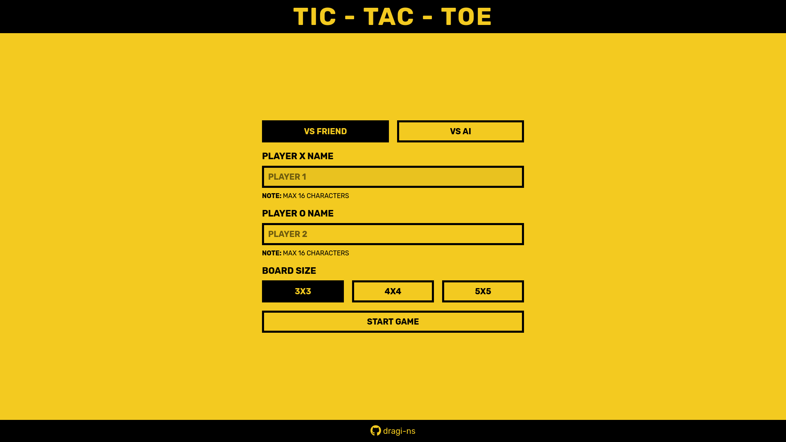
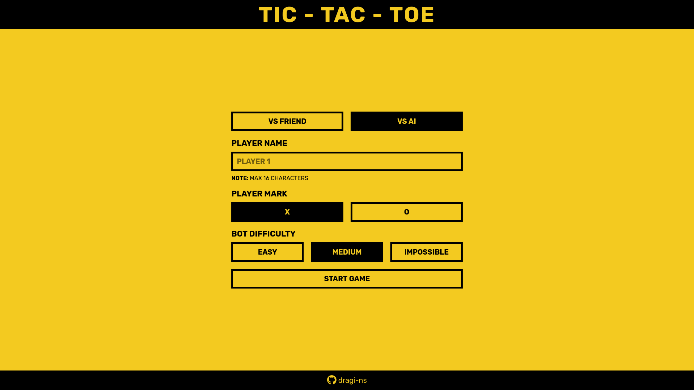
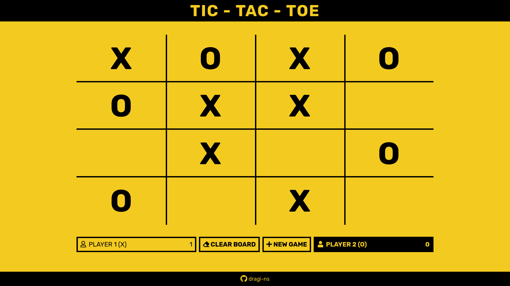
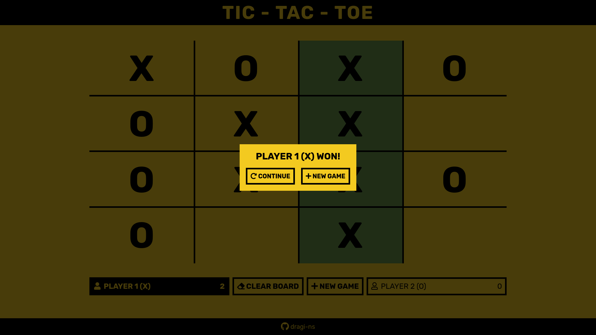
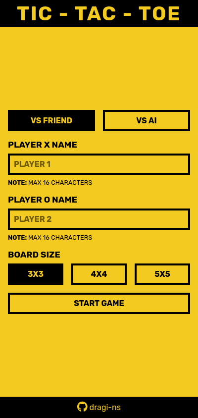
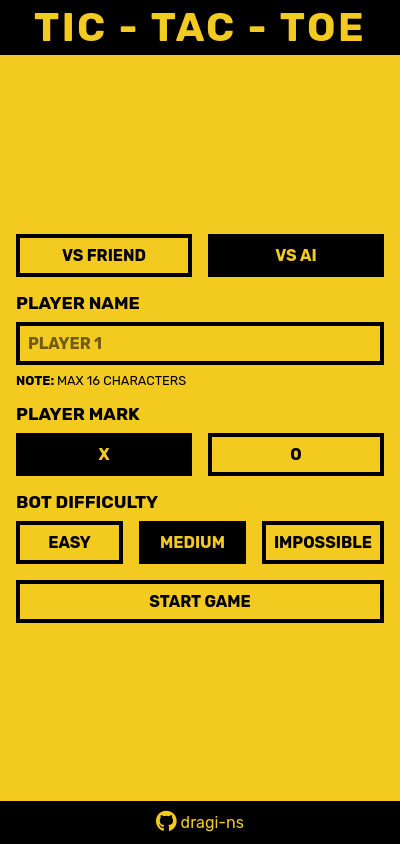
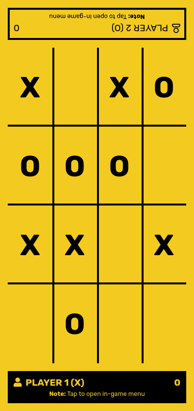
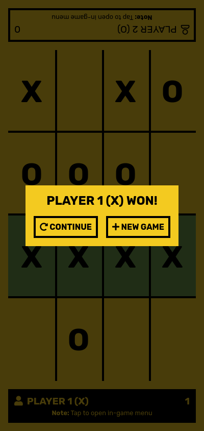

# Tic Tac Toe - Odin project
[Tic Tac Toe](https://en.wikipedia.org/wiki/Tic-tac-toe) implemented in JavaScript with a simple graphical user interface. This project was an assignment from [Odin's Full Stack JavaScript path](https://www.theodinproject.com/paths/full-stack-javascript/courses/javascript/lessons/tic-tac-toe).

## Screenshots

### Desktop

### Mobile

## Demo

